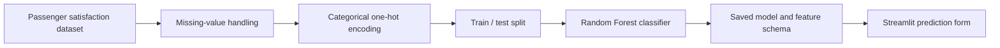
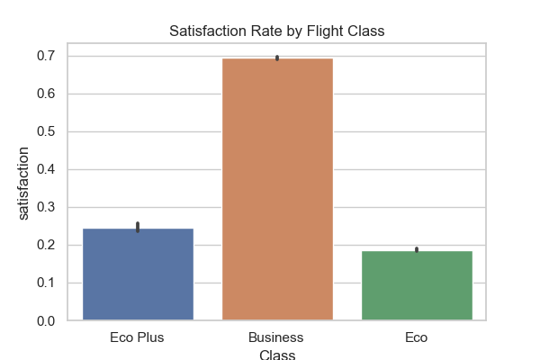
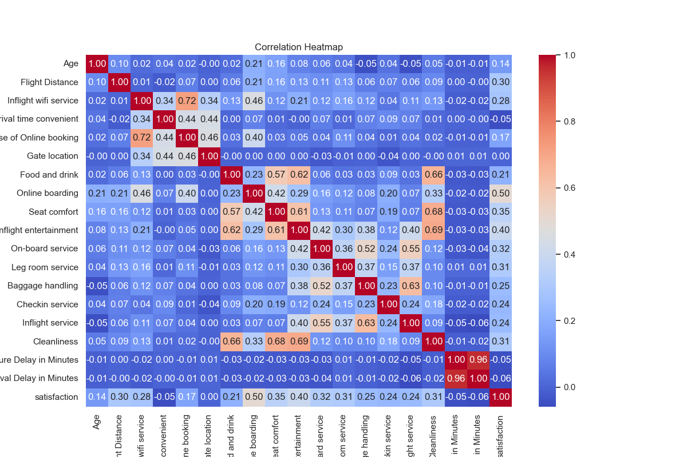

# Airline Passenger Satisfaction Predictor

A machine-learning application that predicts whether an airline passenger is likely to be satisfied based on trip context and service ratings. The repository combines exploratory analysis, preprocessing, a Random Forest classifier, and an interactive Streamlit interface.

## What it does

- Collects passenger, flight, and service-quality inputs in a Streamlit form.
- Applies the same one-hot-encoded feature layout used during model training.
- Predicts satisfied or dissatisfied using a Random Forest classifier.
- Includes exploratory charts for travel class, gender, travel type, and feature correlation.
- Retrains and saves the model automatically if serialized artifacts are unavailable.

## Model workflow



The target is the dataset's `satisfaction` field. Identifier columns are removed, missing arrival-delay values are filled, and categorical features are converted with `pandas.get_dummies`. The model uses a reproducible `random_state=42` split and estimator configuration.

## Exploratory analysis

| Satisfaction by class | Feature correlation |
| --- | --- |
|  |  |

Additional analysis is available in `notebooks/eda.py` and the generated plots under `notebooks/`.

## Run locally

```bash
python -m venv .venv
source .venv/bin/activate
pip install -r requirements.txt
streamlit run app.py
```

On the first run, `app.py` trains the model from `data/train.csv` if `rf_model.pkl` and `feature_names.pkl` are not present.

## Repository structure

```text
app.py            Streamlit application and fallback training path
model.py          standalone model-training script
main.py           data-cleaning inspection script
data/             train and test datasets
notebooks/        exploratory analysis and generated charts
requirements.txt  Python dependencies
```

## Limitations

- The application predicts reported passenger satisfaction, not cancellations or passenger no-shows.
- The current split is random rather than chronological.
- Predictions reflect the variables and population represented in the included dataset.
- Service conditions, routes, and passenger expectations can change over time, so production use would require monitoring and retraining.
